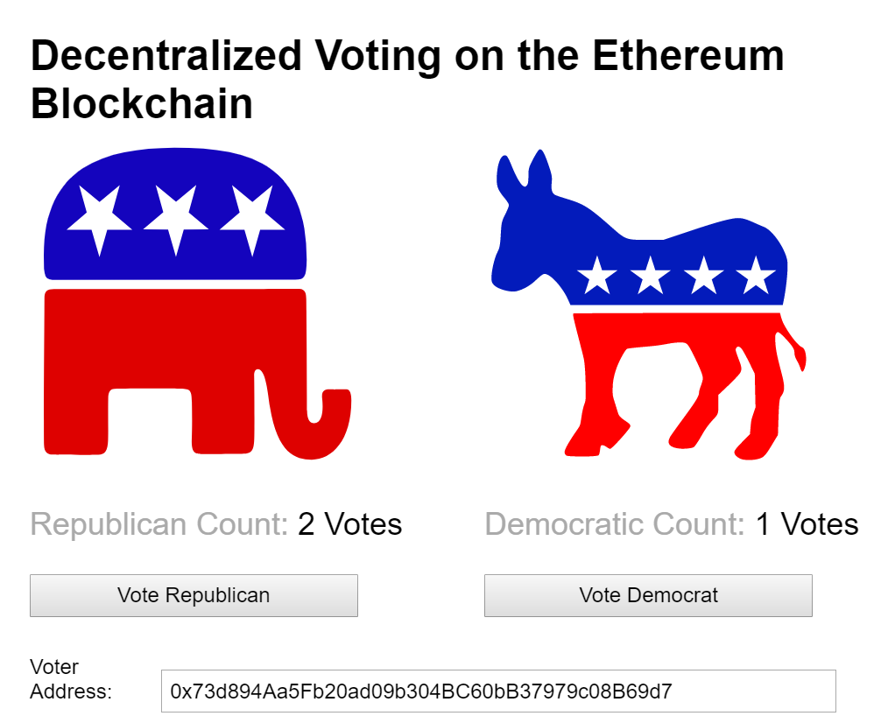

# Distributed Voting

This repository is an implementation of a mock election to be run on Ethereum.



## Installation

1. Install Truffle and Ganache globally.
    ```javascript
    npm install -g truffle
    npm install -g ganache-cli
    ```

2. Clone the repo and install the dependencies.
    ```javascript
    git clone https://github.com/mandeldr/DVote.git
    npm install
    ```

3. Run the blockchain locally.
    ```javascript
    ganache-cli
    ```

4. Compile and migrate the smart contracts.
    ```javascript
    truffle compile
    truffle migrate
    ```

5. Run the webpack server for front-end hot reloading (outside the development console). Smart contract changes must be manually recompiled and migrated.
    ```javascript
    // Serves the front-end on http://localhost:8080
    npm run dev
    ```

